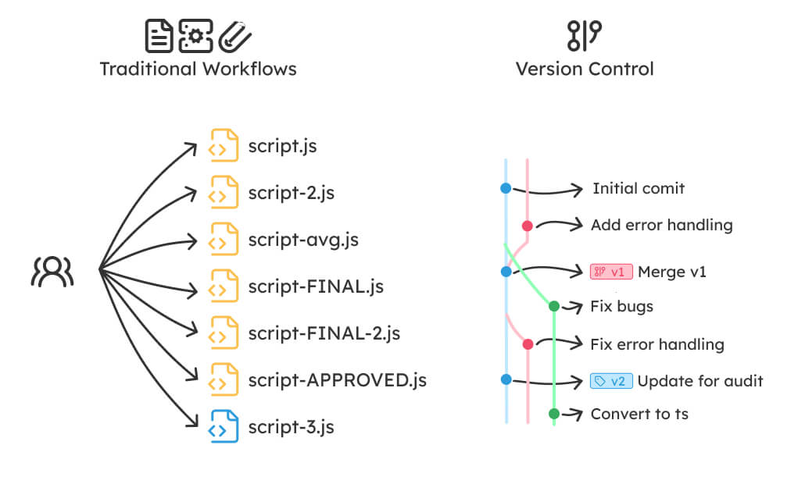
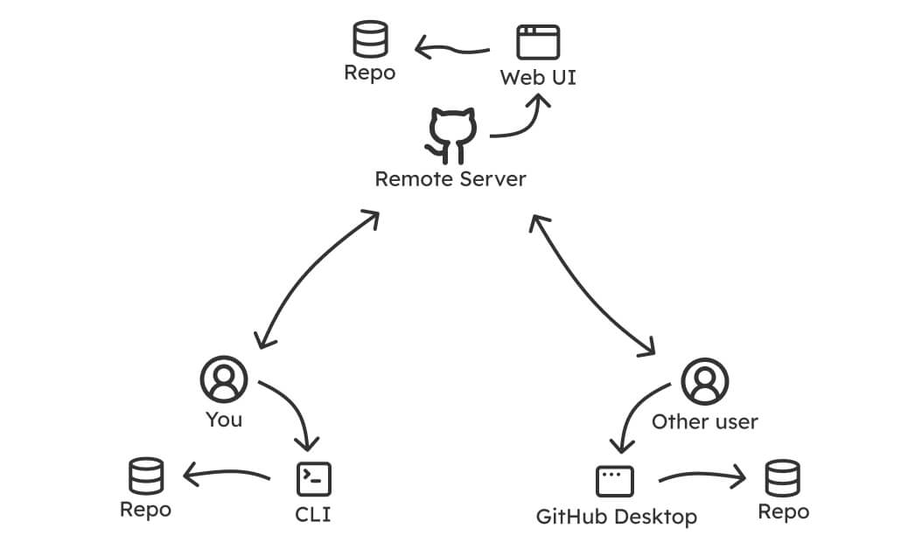
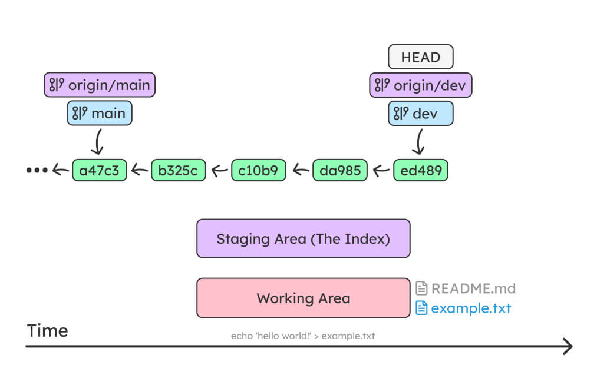
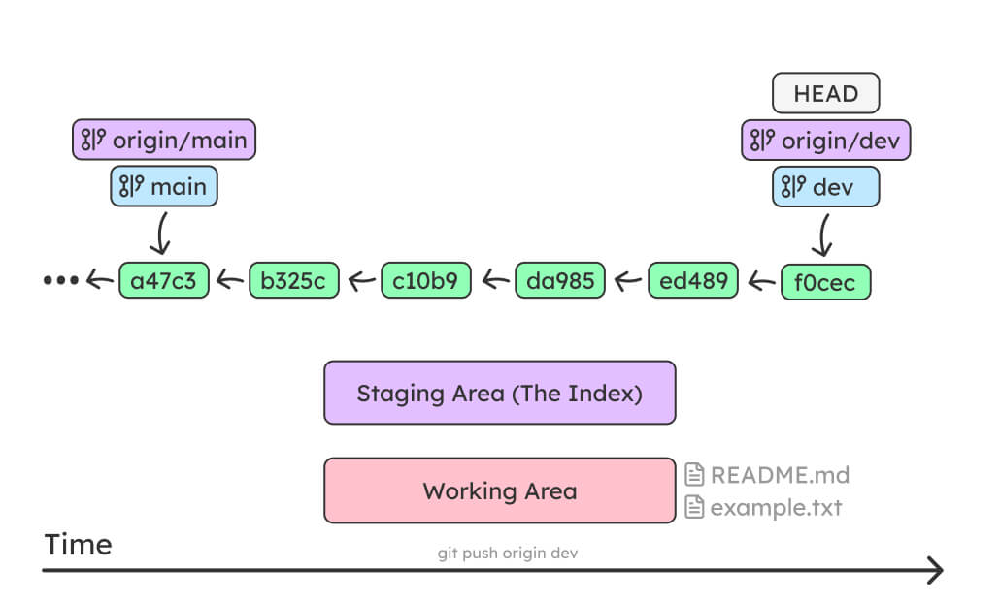
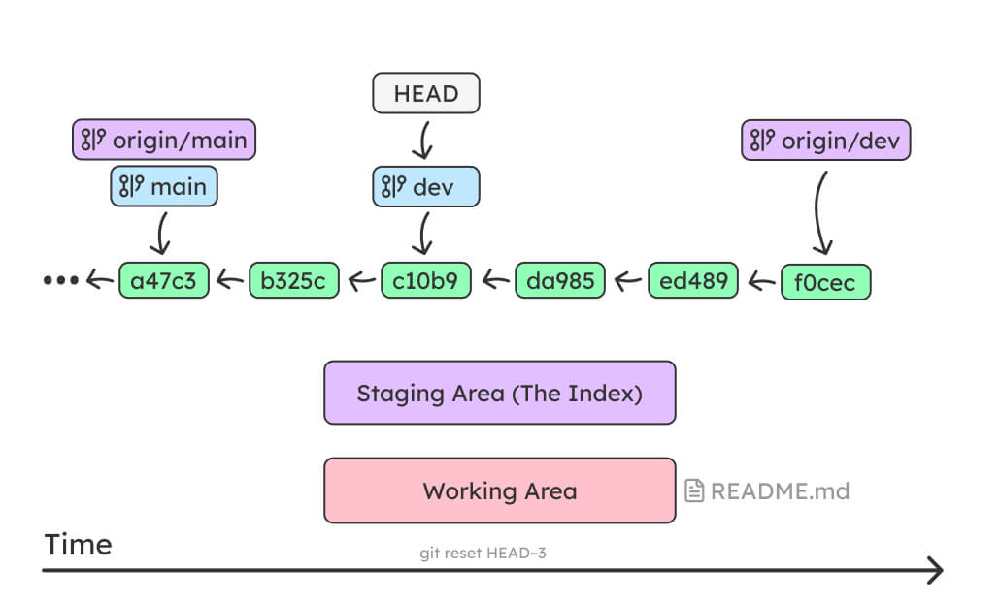

# Version Control

## What is Version Control


- A system that manages and keeps records of changes made to files
- Allows for collaboration
- Associates changes with authors
- Allows you to revert changes and go back to a previous state
- Useful beyond code/programming



## Git

- A Version Control System
- Created by **Linus Torvalds** in 2005
- Replacement for BitKeeper to manage the Linux Kernel
- Command Line Program
- Distributed Version Control
- Cross-platform
- Free and Open Source

### Distributed

All _contributors_ have a copy of the repo, with all files and the full history.

Contributors sync their repos **through** the use of a central remote repo, e.g. **GitHub**.

Hosted remotes like GitHub also provide access to the repo through a web browser.

### Interface

- Command Line Interface by default
- Many available GUIs. (**Github Desktop**, **GitKraken**, Internal IDE tooling)
- Web UIs by remote repo providers like **GitHub**



### How Git Works


- Git tracks your files using **“snapshots”**, records
  of the files in your project at a given point
  in time
- You decide when to take a snapshot and of what files, this
  is known as a **commit**
  - Can be used as noun or verb
  - _“I commited code”_ and _“I just made a new commit”_
- Have the ability to go back and visit any commit
- A project is made up of a bunch of commits

### Terminology

- **Repository** - A project or code-base. AKA **repo**
- **Working Tree** - Any directory that has a repo associated with it
- **Commit** - A snapshot of the repo at a point in time. Identified by a hash
- **The Index** - AKA **Staging Area**. Tracks changes to be committed
- **Branch** - A group of commits with a specific name. A version of the repo. A repo must have a default branch (default names: `main` or `master`).
- **Tag** - A label for a commit. Used with releases.
- **HEAD** - Points to the currently _checked out_ code
  - If a branch: HEAD points to the branch name
  - If a specific commit: Detached Head. points to the hash of the commit.

### Repository

- A project, or group of files that you want to track together
- Often referred to as a **repo**, a collection of files and
  the history of those files (i.e. commits)
- Can live on a local machine or on a remote server (e.g. GitHub)
- The act of copying a repo from a remote server is called **cloning**
- Cloning from a remote server allows teams to work together
- The process of downloading commits that don’t exist on your
  machine from a remote server is called **pulling** changes
- The process of adding your local changes to a remote repo
  is called **pushing** changes


### Commits

Commits contain 3 pieces of information:

1. Commit Message - Information about the changes from the previous commit
2. A reference to the previous commit, AKA the parent commit
3. An SHA-1 hash code (e.g. `fb2d2ec5069fc6776c80b3ad6b7cbde3cade4e`)

#### Sha-what?

- Hashing is the process of transforming any given key or a string of characters into another value. Typically a shorter, fixed-length value
- SHA-1 is a hashing algorithm. It takes some data as input and generates a **unique** 40 character string from it.

#### Atomic Commits

- Single Responsibility Principle: A unit of code should do only one thing
- Atomic commits are the smallest possible change that is meaningful on its own
- Ideally can be described in one simple sentence
- Why?
  - An atomic change is a reversible change
  - Clean git history
  - Easier to review and understand changes

#### Making a commit

- Make changes to files

```bash
echo 'hello world!' > example.txt
```

- Add the changed files to the staging area

```bash
git add example.txt
# OR
git add .
```

- Add a commit with a commit message

```bash
git commit -m 'Add `example.txt` file
```

- (Optional) Push the changes to remote

```bash
git push origin main
```

#### Commit Messages


> [https://cbea.ms/git-commit/](https://cbea.ms/git-commit/)

2. Separate subject from body with a blank line
3. Limit the subject line to 50 characters
4. Capitalize the subject line
5. Do not end the subject line with a period
6. Use the imperative mood in the subject line
   - If applied, this commit will "your commit message"
7. Wrap the body at 72 characters
8. Use the body to explain what and why vs. how

> In addition to the general commit guidelines, organizations and projects can have their own preferences and conventions for commit messages

### Branches


- A group of commits
- All commits live on a branch
- There can be many branches, but each repo must have one default branch
- Each branch is a separate different version of the repo
- The default branch is called `master` or `main`
- One branch can be **merged** into another

### Overview


```bash
echo 'hello world!' > example.txt
```



```bash
git add example.txt
```


```bash
git commit -m 'Add example.txt'
```


```bash
git push origin dev
```



```bash
git reset HEAD~3
```



```bash
git reset --hard origin/dev
```


### Further Reading

- [https://www.rithmschool.com/courses/git](https://www.rithmschool.com/courses/git)
- [https://www.codecademy.com/learn/learn-git](https://www.codecademy.com/learn/learn-git)
- [https://missing.csail.mit.edu/2020/version-control](https://missing.csail.mit.edu/2020/version-control)
- [https://ohshitgit.com](https://ohshitgit.com)
- [https://jvns.ca/blog/2024/01/26/inside-git](https://jvns.ca/blog/2024/01/26/inside-git)
- [https://jvns.ca/blog/2024/03/08/how-head-works-in-git](https://jvns.ca/blog/2024/03/08/how-head-works-in-git)

## GitHub

- A website for storing your git projects
- Users can have personal repositories, both public and private
- Organizations can have repositories with fine-grained access control
- Home to _many_ open-source projects
- Alternatives: BitBucket, GitLab

### Pull Requests

- A proposal to merge a set of changes from one branch into another
- Includes a title and description
- Proposed changes can be discussed with and reviewed by other collaborators
- Reviewers can request changes required to satisfy requirements/standards
- Follow-up commits are added in response to feedback
- If given the green light by reviewers, the pull-request is merged

### README.md

- All the information about the project included in this document
- Uses markdown syntax to make your file clear and easy to read
- Can include information about getting started or deployment
- Can include information about code structure and standards
- Can include functional breakdown and even documentation

### SSH Keys

> [https://docs.github.com/en/authentication](https://docs.github.com/en/authentication)

- Secure Shell Protocol
- Cryptographic network protocol for secure access over insecure network
- username/password authentication can be cumbersome and insecure. Doubly so when using 2FA.
- Makes using multiple accounts trivial
- Access to an SSH key can be easily revoked
- Simplifies **Commit Signing**, verifying that the commit came from a trusted source

### Other Offerings

- Actions - Automate your workflows. (Tests, linting, CI/CD)
- Issues - Keeping track of bugs, feature requests, and ongoing work
- Releases - Automatically create and share build artifacts and setups
- Projects
- The GH cli - Embrace the terminal

### Accepting Invites

[https://bit.ly/accepting-invites](https://bit.ly/accepting-invites)


# Misc

## Two-Factor Authentication (2FA)

**What it is:**

An extra layer of security for your online accounts that requires two forms of identification to log in.

**How it works:**

- 1st Factor: Something you know, like your password or PIN.
- 2nd Factor: Something you have, like your phone, a security key, or biometrics (fingerprint, face recognition).

**Why use it?**

- Adds an extra hurdle for malicious actors, even if they steal your password
- Keep sensitive information like financial records secure

**Methods of 2FA**

- SMS Passcode - A one-time code sent via text message to your phone. (Convenient but insecure. Susceptible to sim swapping attacks)
- Authenticator App - Generates time-based one-time codes on your phone with an app (More secure than SMS)
- Push Notification - Approve login attempts directly from your phone with a tap (Convenient and secure for some services)
- Security Key - Physical device that plugs into your computer or phone to generate login codes (Most secure option)
- Biometrics - Fingerprint, iris scan, or facial recognition. (Convenient but may not be available for all services)

**Recommended**: 2FAS (Google Authenticator, Microsoft Authenticator)

## Password Managers

Password managers are secure applications that help you generate, store, and manage strong, unique passwords for all your online accounts.

**What they do:**

- Generate strong, random passwords for each website or service.
- Securely store your passwords behind a single master password.
- Automatically fill in login credentials on websites and apps.
- Can store secure notes and other sensitive information like bank accounts, backup codes

**Why use a password manager?**

- **Stronger Passwords**: Eliminates the risk of weak and duplicate passwords
- **Improved Security**: Reduces the chance of hacking due to password breaches
- **Convenience**: Auto-fill saves time and frustration by entering login details automatically
- **Organization**: Keeps all your passwords in one secure place
- **Security Features**: Many offer additional features like two-factor authentication and secure password sharing
- **Cross-Platform Support**: Access your passwords from any device with the password manager app

**Recommended**: BitWarden
